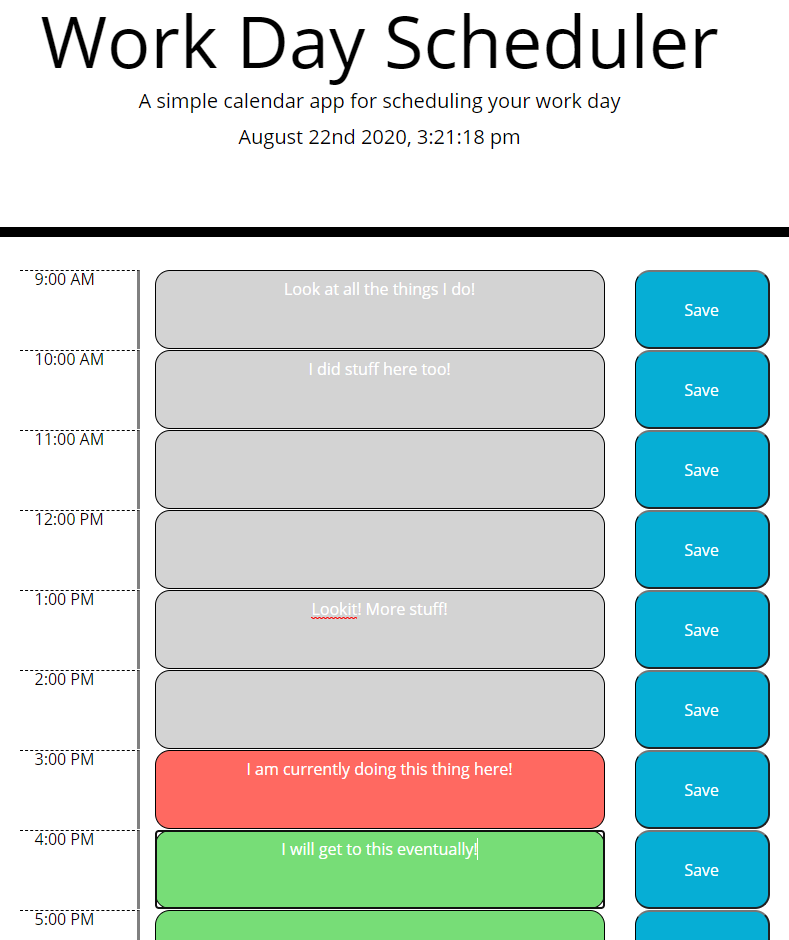

# Daily Planner 

Daily Planner is a tool that was created to help keep track of different items that either need to get done that day or even meetings that will be had. It follows the generic work day time of 9:00 AM to 5:00 PM. You can type something into the text block and click the save button to attatch that specific text to the local storage so you can refresh and keep your list together and in order. To clear out the text areas all you need to do is to delete the text and click the save button again.

This is deployed [here](https://mrcartree.github.io/daily-planner/)

Authored by [Zach LaFleur](http://github.com/MrCartree)